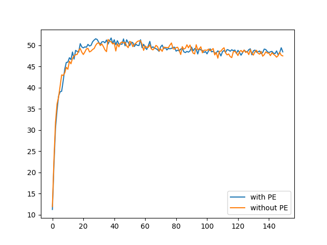

# torch_basic_MLP_with_PE

아주 간단한 MLP에 positional embedding을 넣으면 성능이 개선될까?

결과는 아쉽다. 성능이 개선되긴 하는데 미미하다.

그래도 MNIST와 CIFAR10에서는 학습과정에서 정확도의 흔들림이 현저하게 줄어드는데, 이 부분은 고민해볼만한 포인트인 듯.

(optimizer는 SGD, lr=1e-4, momentum=0.999[로 통일)

## MNIST

MNIST는 pe를 안 넣어도 이미 정확도가 99%에 육박해서 무의미하다 판단해서 생략

## CIFAR10 훈련 결과 (500, 300, 100)

## CIFAR100 훈련 결과 (500, 500, 300, 300)

# Future Works

- ImageNet과 같은 큰 데이터셋에서 실험해보기

  데이터셋 용량만 100GB단위이다 보니 toy project로 하기에는 좀 과한 느낌이 있어서 생략했음.

- ResNet과 같은 CNN 계열에도 pe를 넣으면 어떨까?

  inductive bias가 작은 MLP 계열 모델의 단점을 보완하기 위해 pe를 넣는 것인데,

  이미 inductive bias가 있는 CNN에서도 pe가 성능을 조금이라도 올릴 수 있을까?

  아싸리 ResNet의 residual connection마다 pe를 넣어주는 방식도 가능할 것 같다.

- wandb 붙이기? 

  간단한 toy project라 wandb까지는 필요없지만 붙여보는 연습하는 것도 괜찮을 듯

- ViT처럼 positional embedding 픽셀별 관계도 파악

# 배운 점

- nn.Module.register_parameter

  Layer가 아니라, 독립적으로 선언된 텐서가 parameter처럼 기능해야할 때가 있다. positional embedding이나 VAE가 대표적인 예시일 듯

  이 때 self(nn.Module).register_parameter를 사용하면 된다.

- detach().cpu().numpy()

  requires_grad=True이고 GPU에 올라간 텐서를 numpy로 변환하고 싶을 경우는 위 변환을 사용한다.

  detach : requires_grad=True인 텐서를 numpy로 변환 가능하게 만들어줌

  cpu : GPU에 올라간 텐서를 CPU로 가져옴

